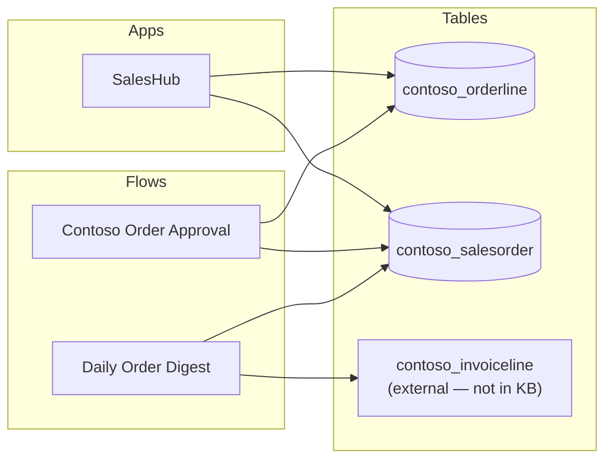

# Cross-Artifact References

## Table → Apps

| Table (logical) | Display name | Used by apps |
|---|---|---|
| `contoso_orderline` | Order Line | SalesHub |
| `contoso_salesorder` | Sales Order | SalesHub |

## Table → Flows

| Table (logical) | Display name | Used by flows |
|---|---|---|
| `contoso_orderline` | Order Line | Contoso Order Approval |
| `contoso_salesorder` | Sales Order | Contoso Order Approval, Daily Order Digest |
| contoso_invoiceline (external — not in KB) | — | Daily Order Digest |

## Connector → Artifacts

| Connector | Artifacts |
|---|---|
| `shared_commondataserviceforapps` | Contoso Order Approval, Daily Order Digest |
| `shared_office365` | Contoso Order Approval, SalesHub |

## Reference graph

---
*Snapshot: org12345.crm5.dynamics.com | cross-reference build*
