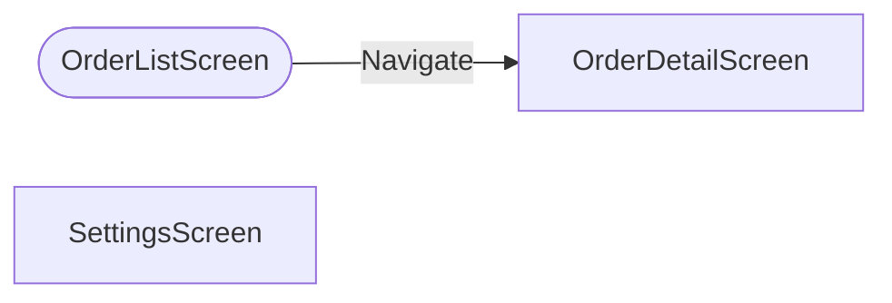

# App: SalesHub (Canvas)

| | |
|---|---|
| Source | `tests/fixtures/canvas-src/SalesHub/Src` |
| Screens | 3 (2 fully parsed, 1 shallow) |
| Components | 1 |

## App-level (App.pa.yaml)

| Property | Formula |
|---|---|
| StartScreen | `OrderListScreen` |
| BackEnabled | `false` |
| OnStart | `ClearCollect(colOrders, SortByColumns('Sales Orders', "contoso_orderdate", Descending)); ↵ Set(varCurrentUser, User().Email)` |

## Data sources

| Name | Type | Details |
|---|---|---|
| `Sales Orders` | Table | contoso_salesorder |
| `Order Lines` | Table | contoso_orderline |
| `Office365Outlook` | Actions | shared_office365 |

## Screen navigation

_Oval node = StartScreen. Screens calling Back(): OrderDetailScreen._

## Screens

| Screen | Parse tier | Controls | Data sources | Doc |
|---|---|---|---|---|
| OrderDetailScreen | full | 4 | Sales Orders | [screens/OrderDetailScreen.md](screens/OrderDetailScreen.md) |
| OrderListScreen | full | 7 | Sales Orders | [screens/OrderListScreen.md](screens/OrderListScreen.md) |
| SettingsScreen | shallow (not matched by filters.screens) | 2 | — | — |

## Components

| Component | Controls | Doc |
|---|---|---|
| HeaderBar | 1 | [components/HeaderBar.md](components/HeaderBar.md) |

---
*Snapshot: SalesHub | commit testcommit | schema v3.0 | Source: `tests/fixtures/canvas-src/SalesHub/Src` (read-only)*
