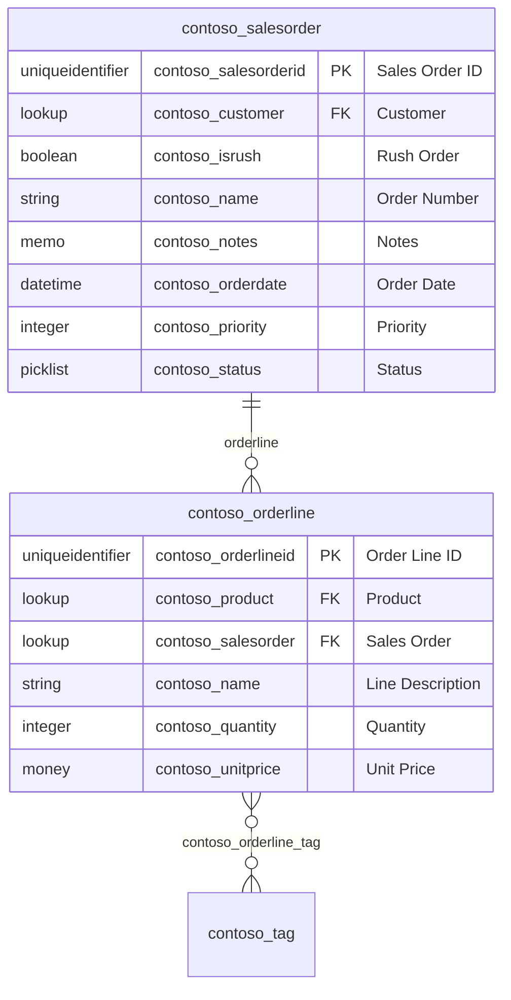

# Dataverse ER Overview

2 tables in scope. Out-of-scope tables appear as boundary nodes without column detail.

> Tables out of scope appear as boundary nodes without column detail.
> Rule: >40 tables → split into sub-diagrams by publisher prefix.

---
*Snapshot: org12345.crm5.dynamics.com | 2026-08-04T09:31:00+00:00 | Raw: `_raw/metadata/`*
