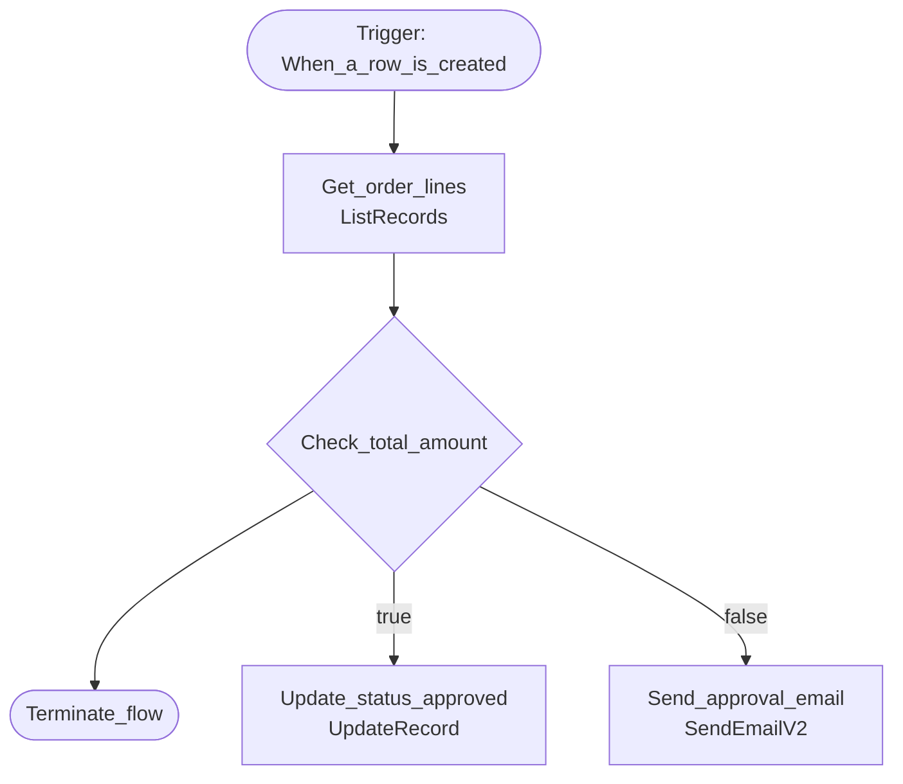

# Flow: Contoso Order Approval

| | |
|---|---|
| Workflow ID | `7f3a9c2e-1111-4222-8333-abcdef012345` |
| State | Activated (statecode 1) |
| Category | 5 (Modern Flow) |
| Modified | 2026-07-28T10:15:00Z |
| Description | Auto-approve small orders, email approver for large ones. |

## Trigger

| Name | Type | Kind | Configuration |
|---|---|---|---|
| When_a_row_is_created | `ApiConnectionWebhook` |  | {"host": {"connectionName": "contoso_sharedcommondataserviceforapps_1a2b3", "operationId": "SubscribeWebhook", "apiId... |

## Actions (5) & dependency graph

| Action | Type | Operation | runAfter | Branch |
|---|---|---|---|---|
| Get_order_lines | ApiConnection | ListRecords | — | — |
| Check_total_amount | If | — | Get_order_lines | — |
| Update_status_approved | ApiConnection | UpdateRecord | — | true |
| Send_approval_email | ApiConnection | SendEmailV2 | — | false |
| Terminate_flow | Terminate | — | Check_total_amount | — |

## Connectors used

| Connection reference | Connector | apiId |
|---|---|---|
| `contoso_sharedcommondataserviceforapps_1a2b3` | shared_commondataserviceforapps | `/providers/Microsoft.PowerApps/apis/shared_commondataserviceforapps` |
| `contoso_sharedoffice365_9f8e7` | shared_office365 | `/providers/Microsoft.PowerApps/apis/shared_office365` |

## Tables touched

`contoso_orderline` · `contoso_salesorder`

---
*Snapshot: org12345.crm5.dynamics.com | 2026-08-04T09:31:00+00:00 | Raw: `_raw/flows/` (clientdata sanitized)*
