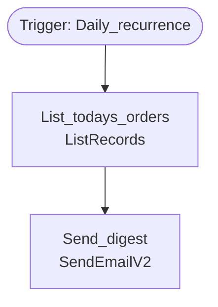

# Flow: Daily Order Digest

| | |
|---|---|
| Workflow ID | `8b4c1d3f-2222-4333-9444-fedcba654321` |
| State | Activated (statecode 1) |
| Category | 5 (Modern Flow) |
| Modified | 2026-07-20T08:00:00Z |
| Description | Every morning, email today's orders to the sales team. |

## Trigger

| Name | Type | Kind | Configuration |
|---|---|---|---|
| Daily_recurrence | `Recurrence` |  | {"recurrence": {"frequency": "Day", "interval": 1, "timeZone": "China Standard Time"}} |

## Actions (2) & dependency graph

| Action | Type | Operation | runAfter | Branch |
|---|---|---|---|---|
| List_todays_orders | ApiConnection | ListRecords | — | — |
| Send_digest | ApiConnection | SendEmailV2 | List_todays_orders | — |

## Connectors used

| Connection reference | Connector | apiId |
|---|---|---|
| `contoso_sharedcommondataserviceforapps_1a2b3` | shared_commondataserviceforapps | `/providers/Microsoft.PowerApps/apis/shared_commondataserviceforapps` |

## Tables touched

`contoso_salesorder`

---
*Snapshot: org12345.crm5.dynamics.com | 2026-08-04T09:31:00+00:00 | Raw: `_raw/flows/` (clientdata sanitized)*
