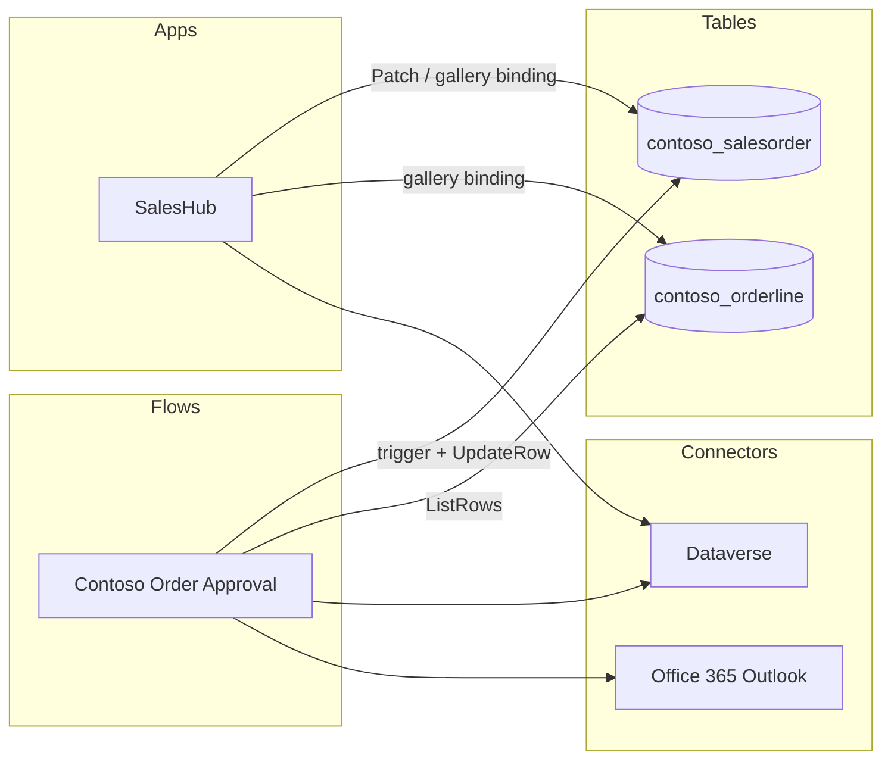

# Cross-Artifact References — ContosoSales

## Table → Apps

| Table (logical) | Display name | Used by apps |
|---|---|---|
| `contoso_salesorder` | Sales Order | SalesHub |
| `contoso_orderline` | Order Line | SalesHub |

## Table → Flows

| Table (logical) | Display name | Used by flows | Operations |
|---|---|---|---|
| `contoso_salesorder` | Sales Order | Contoso Order Approval | trigger (row created), UpdateRow, GetRow |
| `contoso_orderline` | Order Line | Contoso Order Approval | ListRows |

## Connector → Artifacts

| Connector (apiId) | Artifacts |
|---|---|
| `shared_commondataserviceforapps` (Dataverse) | Contoso Order Approval, SalesHub |
| `shared_office365` (Office 365 Outlook) | Contoso Order Approval |

## Reference graph

