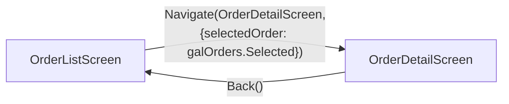

# App: SalesHub (Canvas)

| | |
|---|---|
| Source | `canvas-src/SalesHub/Src/` (Git Integration, commit `a1b2c3d`) |
| Screens | 2 (OrderListScreen, OrderDetailScreen) |
| Components | 1 (HeaderBar) |
| Solution match | ContosoSales (via solutioncomponents, canvasapp `SalesHub`) |

## App-level (App.pa.yaml)

- **OnStart**: `ClearCollect(colOrders, SortByColumns('Sales Orders', "contoso_orderdate", Descending))`
- Declared data sources: `contoso_salesorder`, `contoso_orderline` (connector: Dataverse)

## Screen navigation

## Screens

| Screen | Purpose (inferred) | Controls | File |
|---|---|---|---|
| OrderListScreen | Order gallery + status filter | 8 | [screens/OrderListScreen.md](screens/OrderListScreen.md) |
| OrderDetailScreen | Edit form + submit | 11 | [screens/OrderDetailScreen.md](screens/OrderDetailScreen.md) |

## Used by / Uses

- Uses tables: `contoso_salesorder`, `contoso_orderline` → see [REFERENCES.md](../../REFERENCES.md)

---
*Snapshot: commit a1b2c3d | 2026-08-04 | Schema validated against pa.schema.yaml v3.0*
