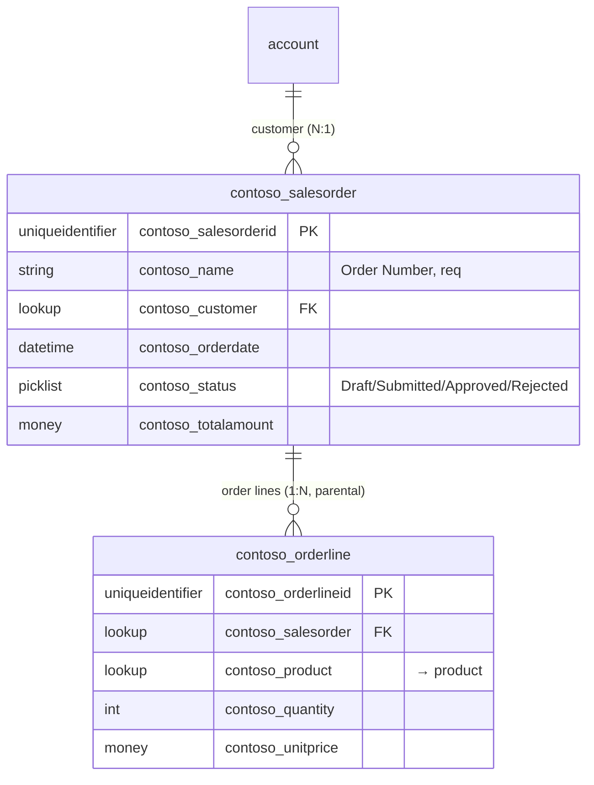

# Dataverse ER Overview — ContosoSales

2 tables in scope. Relationship metadata from `RelationshipDefinitions` (see `_raw/metadata/`).

> Tables out of solution scope (`account`, `product`) appear as boundary nodes without column detail.
> Rule: >40 tables → split into sub-diagrams by publisher prefix.
