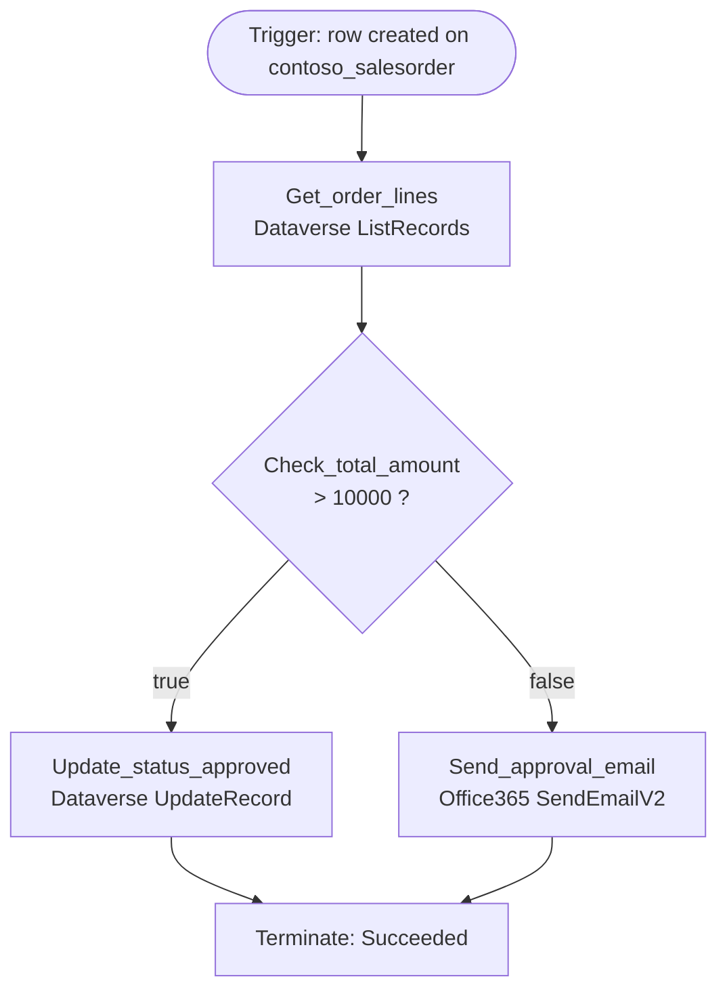

# Flow: Contoso Order Approval

| | |
|---|---|
| Workflow ID | `7f3a9c2e-…-d41b` |
| State | Activated (statecode 1) |
| Category | 5 (Modern Flow) |
| Modified | 2026-07-28 by admin@contoso.com |
| Solution | ContosoSales 1.4.2 |

## Trigger

| Type | Kind | Target | Configuration |
|---|---|---|---|
| `ApiConnectionWebhook` | Dataverse | `contoso_salesorder` | When a row is created; scope: Organization |

## Actions (5) & dependency graph

| # | Action | Type | Connector operation | runAfter |
|---|---|---|---|---|
| 1 | Get_order_lines | ApiConnection | Dataverse `ListRecords` (`contoso_orderlines`, filter `_contoso_salesorder_value eq triggerOutputs()?['body/contoso_salesorderid']`) | — |
| 2 | Check_total_amount | If (Condition) | `@greater(triggerOutputs()?['body/contoso_totalamount'], 10000)` | Get_order_lines |
| 3 | Update_status_approved | ApiConnection | Dataverse `UpdateRecord` → `contoso_status = 100000002` | Check_total_amount (Succeeded, branch=True) |
| 4 | Send_approval_email | ApiConnection | Office365 `SendEmailV2` | Check_total_amount (Succeeded, branch=False) |
| 5 | Terminate | Terminate | status `Succeeded` | Update_status_approved, Send_approval_email |

## Connectors used

| Connection reference (logical) | Connector | Instance |
|---|---|---|
| `contoso_sharedcommondataserviceforapps_1a2b3` | Dataverse (`shared_commondataserviceforapps`) | `<redacted-instance>` |
| `contoso_sharedoffice365_9f8e7` | Office 365 Outlook (`shared_office365`) | `<redacted-instance>` |

## Tables touched

`contoso_salesorder` (trigger, UpdateRecord) · `contoso_orderline` (ListRecords)

---
*Snapshot: org12345.crm5.dynamics.com | 2026-08-04 | Raw: `_raw/flows/7f3a9c2e-….json` (clientdata, `$authentication` removed)*
