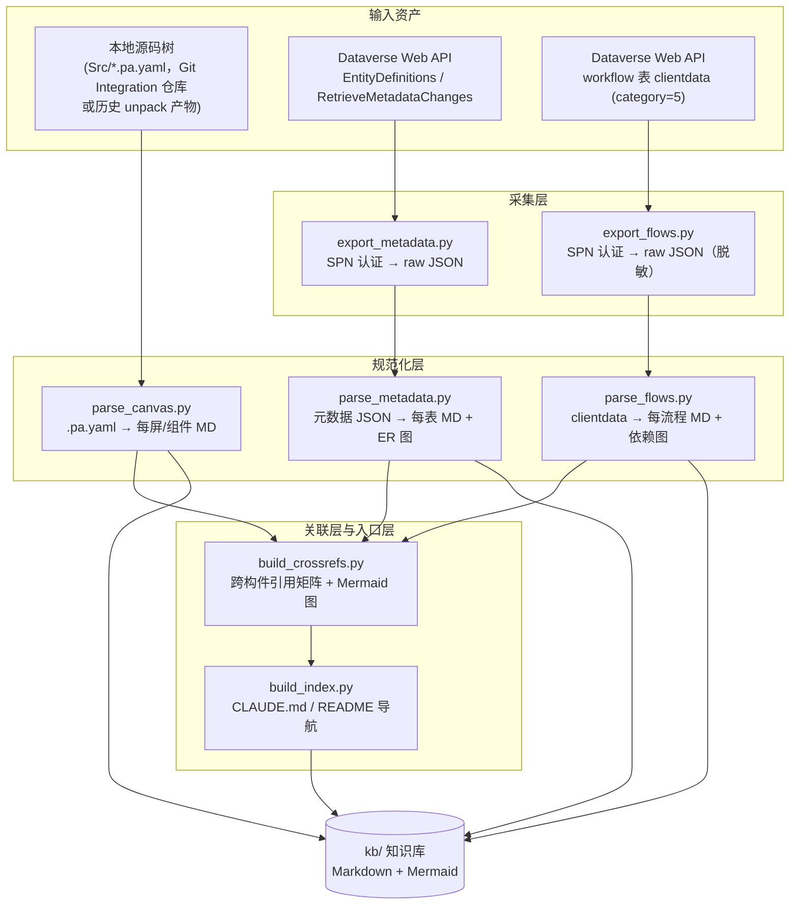

# Power Platform 代码知识库 Skill 实施方案

> 基于《PowerPlatform代码知识库构建可行性调研报告》（2026-08）的落地设计
> 版本：v1.3（新增部分覆盖场景设计）| 日期：2026-08-04
>
> **v1.1 修订说明**：通过 5 路并行核实（git clone 一手源码 + MS Learn 官方搜索 API），对 v1.0 中全部 ⚠️【需复核】项完成了验证，详细证据见 `research/verify-*.md` 五份报告。主要修正：① pac canvas unpack 已进入弃用周期，.pa.yaml 主采集路径为 Git Integration；② 数据源声明在 .pa.yaml 文件内部，fx.yaml 时代的 DataSources/、Connections/ 独立目录布局已淘汰；③ RetrieveMetadataChanges 为 GET 且有 90 天增量过期；④ workflow 表有独立的 connectionreferences 列与 clientdataiscompressed 标志；⑤ 排除 Dataverse MCP 的真实理由修正为 admin consent/allowlist。
>
> **v1.2 确认结论**（详见 §12）：① Canvas 输入双路径自适应（Git Integration / pac unpack）；② Web API 走 HTTP 代理（已实测连通）；③ PyYAML 走 pip 安装；④ SPN 用 client secret（现成可用）；⑤ 项目全英文；⑥ 单环境 + 配置化切换，流程/表支持按 solution 与名称（display/logical）过滤；⑦ kb/ 置于 Claude Code 项目目录内，脱敏后 `_raw/` 允许入 Git。

---

## 0. 调研方式说明（重要）

本方案编写过程中尝试了两种外部调研手段，结果如下：

| 手段 | 结果 |
|---|---|
| `deep-research` skill | 本机未注册该 skill，无法调用 |
| WebFetch（github.com / learn.microsoft.com） | **被企业安全策略拦截**（"Unable to verify if domain is safe to fetch… enterprise security policies"） |
| WebSearch | 搜索引擎过载/降级，无法返回有效结果 |

**这本身印证了内网环境的约束**：不仅目标机器在施行时无法随意外访，连调研机器的外联也受控。因此本方案的内容来源为：

1. 调研报告（信息源为 2026 年 7–8 月 Microsoft Learn / GitHub 公开资料，质量高、与我的既有知识一致）；
2. 我的既有知识中对相关项目的了解（microsoft/power-platform-skills、power-cat-skills、modery/PowerDocu、pac CLI、.pa.yaml schema v3.0、RetrieveMetadataChanges、workflow 表 clientdata 等）。

**凡标有 ⚠️【需复核】的条目，表示该细节应在有外网条件时二次确认后再冻结设计。**

**方案设计的核心原则由此确定为**：最小外部依赖、纯本地脚本、可离线交付、输出物不含任何运行时外部调用。

**第二轮核实（v1.1）**：后续探测发现本机网络为白名单式过滤——`github.com`/`learn.microsoft.com`/`pypi.org` 可直连（git clone 可用），Google/DuckDuckGo/raw.githubusercontent.com 被封。据此改用一手源码核实：5 个并行 subagent 浅克隆 7 个仓库 + MS Learn 官方搜索 API，v1.0 中全部 ⚠️【需复核】项已闭环（证据见 `research/verify-*.md`）。§0 上述第一轮的受限结论仅作背景保留。

---

## 1. 目标与范围

构建一个 Claude Code skill（暂名 `pp-kb-builder`），输入三类资产，输出一套面向 coding agent 阅读的 Markdown 知识库：

| 输入 | 来源 | 采集方式 |
|---|---|---|
| Canvas App 源码（.pa.yaml） | Git Integration 提交的 Git 仓库（**官方主路径**），或 pac canvas unpack 产物（⚠️ 已 deprecated，见 §4.1） | 纯本地文件扫描，**不依赖 pac CLI** |
| Dataverse 实体元数据 | 云端环境 | Web API（OData v4.0），SPN 认证 |
| Power Automate 流程定义 | Dataverse workflow 表 | Web API 查询 `clientdata` 字段（category=5） |

输出：结构化 Markdown 文件树 + Mermaid 图（ER 图、流程依赖图、屏幕导航图、跨构件引用图）+ AGENTS.md/CLAUDE.md 导航入口。

**明确不做的事**：
- 不做"AI 改写 app 并回推云端"（官方 Canvas Authoring MCP 的定位，Preview 且需 Studio 浏览器标签页保持打开，无法无人值守，详见 §8.4）；
- 不引入向量 RAG（第二阶段增强项）；
- 不依赖 Dataverse 官方 MCP server（需 tenant admin consent + 每环境 allowlist；直连 Web API + SPN 审核面更小，详见 §8.4）；
- 不内置 pac CLI（采集由使用方在施行前完成，skill 只读本地目录）。

---

## 2. 总体架构



设计要点：

- **采集与解析分离**：凡需要网络的步骤（export_*）与纯本地步骤（parse_*）严格分离。网络受限时可用任何方式（如另一台可外联机器、手工 Postman 导出）备好 raw JSON，解析链路照常工作。这是内网适配的关键。
- **幂等可重跑**：所有脚本重复执行产生相同结果，知识库可整体删除重建并纳入 Git diff 审计。
- **原始层保留**：`kb/_raw/` 保留采集到的原始 JSON（脱敏后），知识库文档全部可从原始层确定性重建。

---

## 3. Skill 结构

```
pp-kb-builder/
├── SKILL.md                      # skill 入口：触发条件、前置检查、分阶段执行指令
├── scripts/
│   ├── pp_common.py              # 公共：环境变量读取、AAD token 获取(urllib)、HTTP 重试、脱敏工具
│   ├── export_metadata.py        # 采集：Dataverse 元数据 → kb/_raw/metadata/*.json
│   ├── export_flows.py           # 采集：workflow 表 clientdata → kb/_raw/flows/*.json
│   ├── parse_canvas.py           # 解析：unpack 目录 → kb/apps/**
│   ├── parse_metadata.py         # 解析：元数据 → kb/dataverse/**（含 ER mermaid）
│   ├── parse_flows.py            # 解析：流程 → kb/flows/**（含 runAfter mermaid）
│   ├── build_crossrefs.py        # 关联：kb/REFERENCES.md + 引用关系 mermaid
│   └── build_index.py            # 入口：kb/CLAUDE.md、各级 README
├── references/
│   ├── pa-yaml-format.md         # .pa.yaml schema v3.0 格式说明（素材已就位，见 §8.3 #6-#9）
│   ├── webapi-metadata-guide.md  # EntityDefinitions / RetrieveMetadataChanges 请求构造参考
│   └── flow-definition-guide.md  # workflowdefinition JSON 解剖参考（trigger/runAfter/operationId）
└── examples/                     # 脱敏后的样例输出，供 agent 对齐格式
```

SKILL.md 的核心行为约定（摘要）：

1. **前置检查**：确认 canvas 源码目录存在；确认四个环境变量已设置（见 §6）；代理连通性与 token 获取实测；缺失时引导用户配置而不是静默失败。
2. **分阶段执行**：默认按"元数据 → 流程 → Canvas → 关联 → 索引"顺序执行，支持只跑单一阶段（用户可能只想刷新流程部分）。
3. **不修改输入**：skill 只读源码目录与环境变量，所有写入限定在 `kb/` 输出目录。
4. **凭据纪律**：禁止把任何环境变量值、token、连接实例信息写入 kb/ 或日志（脱敏规则见 §7）。

### 3.1 用户使用旅程（v1.3 新增）

| 阶段 | 用户动作 | skill / 知识库行为 |
|---|---|---|
| 一次性安装 | skill 拷入 `.claude/skills/pp-kb-builder/`；`pip install pyyaml`；设 5 个环境变量；编辑 `pp-kb.config.json` | — |
| 首次构建 | 在 Claude Code 中说"构建 Power Platform 知识库" | preflight（依赖/凭据/代理/源码形态识别）→ 六步流水线 → 末步 redaction scan；任一前置失败则停下并给出修复指引 |
| 日常使用 | 正常向 AI 提问/派任务，无需再碰 skill | AI 经 `kb/CLAUDE.md` 自助导航：SCOPE.md 定边界 → REFERENCES.md 定位 → grep → 按需读单文件 |
| 刷新 | 说"刷新知识库"或"只刷新流程" | 幂等重建（元数据走版本戳增量，90 天过期自动全量）；kb/ diff 入 Git review |
| 换环境 | 换 `pp-kb.config.json` / 环境变量，重新构建 | 页脚环境标识防止跨环境误用 |

---

## 4. 三类解析器技术设计

### 4.1 Canvas App（.pa.yaml，schema v3.0）

**采集路径现状（v1.1 已核实）**：

| 路径 | 状态 | 结论 |
|---|---|---|
| Power Platform Git Integration | ✅ 官方推荐 | .pa.yaml 直接提交 Git 仓库，是当前唯一活跃的主路径 |
| `pac canvas unpack` | ⚠️ 官方标注 **deprecated** | 仍可用但进入弃用周期，新系统不应以其为唯一依赖 |
| `pac solution unpack` + `--processCanvasApps` | ❌ 参数已从 pac 参考页移除 | unpack 后 canvas app 仅以 .msapp 存于 `canvasapps/`，**不再展开为 YAML** |

**输入（v1.2 确认：双路径自适应）**：任何包含 `Src/*.pa.yaml` 的源码树。解析器入口自动识别来源形态并走对应分支：

| 形态 | 识别特征 | 处理 |
|---|---|---|
| Git Integration 仓库 | 仓库根含 `.powerapps/` 或 solution 元数据 + `Src/*.pa.yaml` | 主路径，直接解析 |
| pac canvas unpack 产物（存量） | `Src/` 同级存在 `Entropy/`、`pkgs/` 等旧布局目录 | 兼容路径，忽略旧布局目录，只解析 `Src/` |

已核实的结构：

```
<AppRoot>/
└── Src/
    ├── App.pa.yaml                  # 顶层五节点之一：App 级公式（OnStart 等）
    ├── <ScreenName>.pa.yaml         # 每屏一个文件：控件树 + Power Fx 公式
    └── Component/*.pa.yaml          # 自定义组件（ComponentDefinitions）
```

关键事实：**数据源声明在 .pa.yaml 文件内部**（顶层五节点：App / Screens / ComponentDefinitions / **DataSources** / EditorState），fx.yaml 时代的 `DataSources/*.json`、`Connections/*.json` 独立目录布局已随旧格式退役——解析与脱敏设计因此简化（连接实例信息不再出现在源码树中）。

**格式细节（已核实，来自 awesome-copilot instruction 与官方 pa.schema.yaml）**：

- 公式必须以 `=` 前缀，冒号后空格必需；单行公式禁用 `#` 与 `:`；多行公式用块标量 `|` / `|+` / `|-`；
- 注释即 Power Fx 注释（`//`、`/* */`）；
- 官方静态 schema：`microsoft/PowerApps-Tooling` 仓库 `schemas/pa-yaml/v3.0/pa.schema.yaml`（584 行，JSON Schema draft-07）——**已克隆入库**（`research/repos/PowerApps-Tooling/`），解析器用它做结构校验与版本检测。

**解析产出**（每个屏幕一份 MD）：

- 控件树摘要（缩进列表：控件名 — 类型 — 关键非默认属性）；
- Power Fx 公式清单（属性名 → 公式文本，原样保留）；
- 本屏引用的数据源（从 YAML 内 DataSources 节点 + 公式中的表名引用交叉确认）；
- `Navigate(...)` 调用提取 → 汇总成**屏幕导航图**（mermaid flowchart）。

**技术要点**：

- 用 PyYAML 加载（唯一第三方依赖，见 §8）。注意 YAML 1.1 布尔陷阱（`On/Off` 等控件属性名高发），加载时使用自定义 resolver 关闭隐式布尔转换；`=` 前缀公式为普通标量，块标量多行公式 PyYAML 原生支持。
- **无真实样本的应对（v1.2 确认：内网样本不可出域）**：解析 spike 使用**合成样本**——依据官方 pa.schema.yaml（draft-07）+ awesome-copilot instruction 中的示例构造一组覆盖控件嵌套、块标量公式、DataSources 节点、组件定义的 .pa.yaml 样本作为测试夹具；解析器对未知字段/结构防御性处理（告警但不中断），待首次在真实环境运行时以实际输出校准。
- 公式**不做全量 AST 解析**。正则提取 `Navigate()`、`Collect()`/`ClearCollect()`、`Patch()` 目标标识符即可满足知识库与关联层需要。AST 级分析列为可选增强——已验证可行路径：PowerDocu 引用 `Microsoft.PowerFx.Core`（MIT）用 `engine.Parse` + `IdentityTexlVisitor` 提取 Set/UpdateContext/Navigate/Collect，此用法可平移到 .pa.yaml，但需引入 .NET 工具链，现阶段不做。
- 大文件防护：单屏 .pa.yaml 超过阈值（默认 1MB）时 MD 中只放属性清单摘要，公式全文留在原文件并给出路径指引，防止知识库膨胀。
- **双层解析（部分覆盖场景，v1.3 新增）**：配置 `filters.screens` 时，命中的屏幕走完整解析；未命中的屏幕只生成**浅层索引条目**（屏幕名、控件名清单、数据源引用、导航边），并入 app overview 而非独立文件。导航图始终基于全部屏幕构建（保证全局结构完整），知识库体积聚焦在负责范围内。

### 4.2 Dataverse 元数据（Web API）

**认证**：client_credentials（见 §6）。

**采集两条路径（v1.1 已核实）**：

| 路径 | 适用 | 说明 |
|---|---|---|
| MVP：`GET /api/data/v9.2/EntityDefinitions?$select=...&$expand=Attributes($select=...)` | 表数量少、快速验证 | 属性类型 cast 写法为 URL 段追加 `/Microsoft.Dynamics.CRM.<派生类型>`（如 PicklistAttributeMetadata、MoneyAttributeMetadata），**一次 $expand 只能 cast 一种类型**，EnumAttributeMetadata 基类不能直接 cast；限语言用 `LabelLanguages=1033` |
| 推荐：`GET /api/data/v9.2/RetrieveMetadataChanges` | 正式使用 | 是 Function，官方示例为 **GET**（非 POST），Query 以 URL 编码 JSON 经参数别名传递（需处理超长 URL）；限语言用 `LabelQuery.FilterLanguages`；增量机制：保存上次响应的 `ServerVersionStamp` 作为下次 `ClientVersionStamp`；**变更记录仅保留 90 天**，过期报 `ExpiredVersionStamp`（0x80044352），必须实现"检测到此错误 → 全量重建"降级逻辑 |

**解析产出**：

- `kb/dataverse/tables/<logicalname>.md`：列清单（逻辑名/显示名/类型/必填/最大长度）、选项集取值表、Lookup 目标表、1:N 与 N:N 关系清单；
- `kb/dataverse/optionsets.md`：全局选项集汇总；
- `kb/dataverse/er-overview.md`：**全局 ER 图**（mermaid `erDiagram`，按关系元数据生成；表超过 ~40 张时按解决方案/前缀拆分子图，避免图不可读）。

### 4.3 Power Automate（workflow 表 clientdata）

**采集（v1.1 已核实）**：

```
GET /api/data/v9.2/workflows?$filter=category eq 5
    &$select=workflowid,name,clientdata,clientdataiscompressed,connectionreferences,statecode,description,modifiedon
```

已核实的字段事实：

- `category` 官方取值：0=Workflow、1=Dialog、2=Business Rule、3=Action、4=Business Process Flow、**5=Modern Flow（云端流程）**、6=Desktop Flow、7=AI Flow；
- **`connectionreferences` 是独立专用列**（Memo），连接引用优先从此列采集，无需解析 clientdata；
- **`clientdataiscompressed` 标志**：解析 clientdata 前必须检查，压缩时先解压；
- `clientdata` 官方描述仅 "Business logic converted into client data"——其内部 JSON 结构（definition/connectionReferences/$authentication）**无官方 schema**，解析器按防御性原则编写（字段缺失不报错、未知字段原样跳过）。

过滤：按 solution 与按名称的过滤为确认需求，统一规则见 §6.3；solution 关联（`solutioncomponents` → `solutions`）的查询写法在实现期验证，失败时降级为全量采集 + 显式告警。

**解析**（clientdata 为内嵌 JSON 字符串，需二次 parse；先检查 `clientdataiscompressed`）：

- `definition.triggers`：type/kind → 触发方式（Recurrence / ApiConnectionWebhook / Request…）；
- `definition.actions` + `runAfter` → 重建执行依赖 DAG → mermaid flowchart（含分支 Condition/Switch 结构标注）。已核实的参考实现：PowerDocu `FlowParser.parseFlow`（Newtonsoft 反序列化 → parseTrigger → parseActions 递归，遇 runAfter 经 ActionGraph 建有向图并拓扑编号）——我们的 Python 解析器按同一思路实现；
- 每个 action 的 `inputs.host.operationId`、`inputs.host.connectionName` → 连接器与操作清单表；
- 连接引用：优先取 workflow 表 `connectionreferences` 专用列（**脱敏后**，见 §7），clientdata 内 `connectionReferences` 作为兼容兜底。

**产出**：`kb/flows/<flowname>.md`（trigger 配置、action 清单表、mermaid 依赖图、连接器清单）。

### 4.4 关联层（核心价值增量）

现有所有工具都不覆盖的能力：**"这张表被哪些 app / flow 使用"**。

匹配规则（确定性、可解释）：

| 引用方 | 提取位置 | 匹配键 |
|---|---|---|
| Canvas App | .pa.yaml 内 DataSources 节点的表逻辑名；公式中 `Patch('Table Name', ...)` 等标识符 | Dataverse 实体 LogicalName / DisplayName |
| Flow | definition.actions[*].inputs.parameters 中的 `table`/`entityName` 字段；operationId 前缀（如 `GetItem`、`CreateRecord`）| 同上 |
| Flow/Canvas → 连接器 | workflow 表 `connectionreferences` 专用列、clientdata `connectionReferences` 的 apiId（如 `shared_commondataserviceforapps`、`shared_sharepointonline`） | 连接器目录（内置常量表） |

产出：

- `kb/REFERENCES.md`：三张矩阵表（表→Apps、表→Flows、连接器→构件）；
- 引用关系 mermaid 总图（flowchart LR：构件 ↔ 连接器 ↔ 表）；
- 每个表/流程/app 的 MD 底部自动追加"被引用/引用"小节（反向链接）。

**边界节点约定（v1.3 新增）**：引用到但未入库的对象（表/流程/连接器）不产生死链——矩阵与图中统一标注 `(external — not in KB)`，ER 图中只出现节点名不出现列细节。agent 可回答"这张外部表被哪些屏幕引用"，但不会因找不到文件而误判知识库损坏或臆造结构。

---

## 5. 知识库输出规范

落盘位置（v1.2 确认）：**Claude Code 项目目录内**（如 `<project>/kb/`）；脱敏后的 `_raw/` **允许随知识库入 Git**（页脚标注采集时间与环境标识便于审计）。全部文档为英文（v1.2 确认）。

```
kb/
├── CLAUDE.md                  # agent 导航入口（阅读顺序、检索策略、目录约定）
├── SCOPE.md                   # 覆盖清单（v1.3）：显式声明 在库/浅层/外部边界 三类对象与采集过滤器
├── _raw/                      # 采集层原始 JSON（已脱敏），知识库可从此整体重建
│   ├── metadata/
│   └── flows/
├── apps/<AppName>/
│   ├── overview.md            # app 级：OnStart 摘要、数据源清单、屏幕导航 mermaid（含浅层屏幕条目）
│   ├── screens/<Screen>.md    # 仅 filters.screens 命中的屏幕生成
│   └── components/<Comp>.md
├── dataverse/
│   ├── er-overview.md         # 全局 ER mermaid（外部表为边界节点）
│   ├── optionsets.md
│   └── tables/<table>.md
├── flows/<flow>.md            # 含 runAfter 依赖 mermaid
└── REFERENCES.md              # 跨构件引用矩阵 + 总图（外部对象标注 not in KB）
```

**部分覆盖三机制（v1.3）**：① SCOPE.md 显式声明知识库边界（"负面知识"，防 agent 寻找不存在的文件或臆造结构）；② 边界节点约定（见 §4.4）；③ Canvas 双层解析（见 §4.1）。典型场景：大 App 全量放入，但只深析自己负责的屏幕/表/流程——导航与引用关系保持全局完整，细节聚焦负责范围。

Mermaid 仅作为 ```mermaid 代码块嵌入 Markdown，**无任何运行时渲染依赖**——渲染发生在查看端（VS Code Mermaid 插件 / Typora / Git 平台），这对内网部署是零成本。

CLAUDE.md 入口约定 agent 阅读路径：先读 REFERENCES.md 建立全局认知 → 按任务定位到具体表/屏/流程文件 → 细节不足时按指引回读 `_raw/` 原始 JSON 或 unpack 目录原始 YAML。

**输出样例**：一套完整的虚构 solution（ContosoSales：2 表 + 1 流程 + 1 个两屏 app）生成结果见 `docs/examples/kb/`——含 CLAUDE.md、REFERENCES.md、表文档、ER 图、流程文档（含 runAfter mermaid）、app 概览与屏幕文档，即各类 MD 的格式契约。

---

## 6. 认证、配置与过滤规范（v1.2 已确认）

### 6.1 环境变量

| 环境变量 | 用途 | 备注 |
|---|---|---|
| `PP_TENANT_ID` | AAD 租户 | |
| `PP_CLIENT_ID` | SPN 应用 ID | 已确认：有现成 SPN；需确保已注册为 Application User 并绑只读安全角色（EntityDefinition/Metadata 读 + workflow 读） |
| `PP_CLIENT_SECRET` | SPN 密钥 | 已确认采用 client secret 形态。仅存于环境变量，**永不落盘、永不入日志** |
| `PP_DATAVERSE_URL` | 环境地址 | 如 `https://org.crm5.dynamics.com` |
| `PP_CONFIG` | 配置文件路径 | 可选，默认 `./pp-kb.config.json` |
| `HTTPS_PROXY` / `HTTP_PROXY` | 内网出口代理 | **已确认 Web API 经 HTTP 代理连通（用户实测）**；urllib 原生支持，pp_common.py 中显式构造 ProxyHandler 并处理代理认证（如需） |

Token 获取：`POST https://login.microsoftonline.com/{tenant}/oauth2/v2.0/token`（**经同一代理**），grant_type=client_credentials，scope=`{PP_DATAVERSE_URL}/.default`，用 **Python 标准库 urllib** 实现。

### 6.2 配置文件（换环境机制，v1.2 确认需求）

单环境使用，但全部环境相关参数集中在 `pp-kb.config.json`（环境变量优先级高于配置文件），换环境 = 换一份配置文件：

```jsonc
{
  "dataverseUrl": "https://org.crm5.dynamics.com",   // 被 PP_DATAVERSE_URL 覆盖
  "labelLanguage": 1033,                              // 已确认：项目全英文
  "canvasSourcePath": "./canvas-src",                 // Git Integration 仓库或 unpack 产物
  "outputDir": "./kb",
  "filters": {
    "solutions": ["ContosoSales"],                    // 可选：只采集这些 solution 内的流程/表
    "tables": ["account", "Contact"],                 // 可选：logicalName 或 displayName 混写，自动双匹配
    "flows": ["Order Approval *"]                     // 可选：名称（显示名）支持通配符
  }
}
```

### 6.3 过滤规则（v1.2 确认需求）

| 过滤维度 | 实现 |
|---|---|
| 按 solution | 元数据侧：经 `solutioncomponents` + `solutions` 表关联反查（实现期验证关联写法，失败时降级为全量+告警）；流程侧同理；**Canvas 侧**：查 solutioncomponents 中 componenttype=canvasapp 的记录得到 app 名，与本地源码树按 app 名/目录名匹配，未匹配到的显式列入告警 |
| 按表名 | `LogicalName` 与 `DisplayName` **双通道匹配**（大小写不敏感）；输入先按 logical 精确匹配，未命中再按 display 匹配，均不命中则告警列出 |
| 按流程名 | 显示名匹配，支持 `*` 通配 |
| 按屏幕名（v1.3） | `filters.screens`，支持 `*` 通配；命中的屏幕完整解析，未命中的降级为浅层索引（见 §4.1 双层解析） |
| 无过滤配置 | 默认全量采集（category=5 流程 + 全部表） |

---

## 7. 安全与脱敏规范

入库前统一经过脱敏器（`pp_common.py` 中单一函数，所有脚本强制调用）：

| 规则 | 对象 |
|---|---|
| 删除 `$authentication` 节点 | clientdata（SecureObject） |
| 删除值中含 `apiKey`/`password`/`secret`/`token`/`clientSecret` 的键（递归，键名不区分大小写） | 所有 JSON |
| workflow 表 `connectionreferences` 列与 clientdata `connectionReferences`：只保留 apiId（连接器类型）与连接引用逻辑名，连接实例 GUID 替换为占位符 | 流程采集 |
| 兼容旧布局：若输入为 fx.yaml 时代 unpack 产物（存在 `Connections/*.json`），只提取 `apiId` 后整体丢弃 | Canvas 输入（兼容路径） |
| 日志与异常输出中过滤 token/secret 值 | 全部脚本 |

此外：`.gitignore` 模板（防止本地配置文件 `pp-kb.config.json` 中含环境特异信息被误推到外部仓库；`kb/` 与 `kb/_raw/` 按 v1.2 确认允许入库）；知识库生成页脚标注采集时间与环境标识（便于审计"这份知识是哪个环境什么时候的快照"）。

---

## 8. 外部依赖清单（**评审重点**）

### 8.1 运行时依赖（skill 本体）

| # | 依赖 | 类型 | 来源 | License | 必需性 | 内网获取方式 | 可替代性 |
|---|---|---|---|---|---|---|---|
| 1 | Python ≥3.10 | 语言运行时 | python.org | PSF | **必需** | 本机已装 3.11 ✅ | 可改为 PowerShell/Node，见 §9 |
| 2 | PyYAML ≥6.0 | pip 包 | PyPI | MIT ✅ | **必需**（.pa.yaml 解析） | ✅ pypi.org / files.pythonhosted.org 已从本机实测可通，可直接 pip install；亦可离线 wheel（纯 Python，无需编译） | 无完美替代；应急可写受限 YAML 子集解析器（工作量大，不推荐） |
| 3 | AAD token 端点 | 网络出口 | login.microsoftonline.com | — | 采集层必需 | 防火墙/代理放行 | 无（SPN 唯一官方无人值守方式） |
| 4 | Dataverse Web API | 网络出口 | `*.dynamics.com` | — | 采集层必需 | 同上 | 可用 pac solution unpack 产物 Workflows/*.json 替代流程采集；元数据无离线替代 |

**除 PyYAML 外零 pip 依赖**：HTTP 用 urllib 标准库，JSON 用标准库，Mermaid 输出为纯文本。

### 8.2 采集侧依赖（skill 之外，由使用方负责）

| # | 依赖 | 来源 | License | 说明 |
|---|---|---|---|---|
| 5 | pac CLI（Microsoft.PowerApps.CLI） | NuGet / dotnet tool | ⚠️ 微软专有许可（免费使用，**非 MIT 开源**） | 仅用于存量 unpack 目录的过渡来源（⚠️ pac canvas unpack 已 deprecated，长期路径为 Git Integration）。skill 不内置、不调用、不依赖 |

### 8.3 知识素材依赖（离线入库，一次性）

以下素材已在 v1.1 核实阶段实际拉取到 `research/`（ licenses 均已确认为 MIT），评审通过后即可移入 skill 的 `references/`：

| # | 素材 | 本地位置 | 用途 |
|---|---|---|---|
| 6 | awesome-copilot `power-apps-canvas-yaml.instructions.md`（827 行，基于 schema v3.0） | `research/assets/` 已有副本 | references/ 格式说明书 |
| 7 | power-platform-skills `references/TechnicalGuide.md`（444 行）+ DesignGuide.md + QAChecks.md | `research/repos/power-platform-skills/plugins/canvas-apps/` | 同上 |
| 8 | 官方 `pa.schema.yaml`（v3.0，584 行，draft-07，来自 microsoft/PowerApps-Tooling） | `research/repos/PowerApps-Tooling/schemas/pa-yaml/v3.0/` | **解析器结构校验依据**（非仅供阅读） |
| 9 | awesome-copilot instruction 中对 raw.githubusercontent 的 schema 引用 | 需替换为 #8 的本地副本 | 内网适配 |

**其他已核实、可按需取用的复用素材**：

| 素材 | 位置 | 复用点 |
|---|---|---|
| analyze-canvas-performance 的 .pa.yaml 扫描维度清单 | `research/repos/power-cat-skills/` | parse_canvas.py 的检查维度参考 |
| Dataverse-skills 的 skill 写作规范（token 预算、反幻觉表） | `research/repos/Dataverse-skills/` | SKILL.md 编写规范 |
| PowerDocu `FlowParser`（runAfter → 有向图 + 拓扑编号） | `research/repos/PowerDocu/` | parse_flows.py 实现思路（仅借鉴，不引用二进制） |
| power-platform-skills 的 power-automate 插件（10 个 skill）与 code-apps/add-dataverse | `research/repos/power-platform-skills/` | 后续扩展参考 |

注意：power-cat-skills 中 skill 引用的 `references/*.md` 在其仓库内不存在（指向 power-platform-skills），素材入库时以 power-platform-skills 仓内文件为准。

### 8.4 明确排除的依赖

| 排除项 | 原因（v1.1 已核实） |
|---|---|
| Dataverse 官方 MCP / Dataverse-skills | 需 tenant admin consent + 每环境 allowlist（此前"Managed Environment/Copilot Credits"说法不准确，已修正）；直连 Web API + SPN 无需任何管理员介入，审核面更小 |
| Canvas Authoring MCP | Preview（微软预览版法律条款）；**必须保持 Power Apps Studio 浏览器标签页打开**（coauthoring 会话），无法无人值守；server 本体为 NuGet 预发版包、需 .NET 10 SDK；报告所述 512KB/组件遗漏/PCF 等限制在仓库内未能证实（来源为 issue 区，本环境不可达），但不影响排除结论 |
| microsoft/Power-Fx（C# AST 解析器） | 公式级 AST 分析属可选增强；已确认 MIT 且有 PowerDocu 引用先例（Microsoft.PowerFx.Core 1.8.1），届时引入 .NET 工具链再评估 |
| PowerDocu（C# / .NET 10） | 仅借鉴 FlowParser 解析思路；其 canvas 解析仍停留在 .msapp 内 JSON 时代（未支持 .pa.yaml），无法直接复用——**反向印证社区在 pa.yaml 解析上确为空白，自建解析器是必要的** |
| 任何向量数据库 / embedding 服务 | RAG 属第二阶段，且内网引入向量栈成本高 |
| msal / requests 等常见 pip 库 | urllib 标准库可覆盖，减少审核面 |

---

## 9. 实现语言选型说明（备选）

| 方案 | 优点 | 缺点 | 结论 |
|---|---|---|---|
| **Python 3.11 + PyYAML**（推荐） | 本机已装；YAML 生态成熟；跨平台 | 需 1 个 pip 包 | ✅ |
| PowerShell 7 | Windows 原生、零安装 | 无内置 YAML 解析（需自写受限解析器，pa.yaml 嵌套深、风险高）；JSON 处理够用 | 仅在 pip 完全不可用时考虑，且只覆盖 Flow/元数据（纯 JSON）两路 |
| Node 20 | 本机已装；js-yaml 成熟 | 仍需 npm 包，与 PyYAML 审核成本相同 | 平替，无额外收益 |

**降级预案**：若 PyYAML 也不获准，则 Canvas 解析降级为"结构化摘录"模式——不解析 YAML 语义，按缩进扫描提取控件名/属性名/公式文本（正则级），Flow 与元数据两路（纯 JSON）不受影响，知识库仍保有约 60% 价值。

---

## 10. 实施路线图

| 阶段 | 内容 | 交付物 | 验收标准 |
|---|---|---|---|
| 0. 前置确认（0.5 天） | 确认 §8 依赖审核结论、网络出口、PyYAML 可得性、SPN 权限 | 依赖放行清单 | 评审签字 |
| 1. MVP：元数据链路（2–3 天） | export_metadata + parse_metadata + pp_common（token/脱敏） | kb/dataverse/** + ER 图 | 与 Maker Portal 抽查 3 张表，列/选项集/关系 100% 一致 |
| 2. Flow 链路（2–3 天） | export_flows + parse_flows | kb/flows/** + 依赖图 | 与 Power Automate 设计器比对 2 个流程，trigger/action/runAfter 一致 |
| 3. Canvas 链路（3–4 天） | parse_canvas + references 入库 | kb/apps/** + 导航图 | 抽查 2 个屏幕，控件树与公式完整；引用官方格式文档可溯源 |
| 4. 关联与入口（2 天） | build_crossrefs + build_index | REFERENCES.md + CLAUDE.md | "表 X 被哪些构件使用"类问题可由知识库直接回答，抽查无漏 |
| 5（可选增强） | 增量同步（RetrieveMetadataChanges 版本戳）、Power Fx AST、向量索引 | — | 另行立项 |

总工期约 2 周（1 人）。阶段 1–2 可并行。

### 10.1 测试与验收策略

测试框架用 **Python 标准库 unittest**（不引入 pytest，保持"仅 PyYAML 一个 pip 依赖"的审核承诺）。

| 层 | 内容 | 夹具来源 | 通过标准 |
|---|---|---|---|
| 单元测试 | 每个 parser 对合成夹具：.pa.yaml（依 pa.schema.yaml + instruction 示例构造，覆盖控件嵌套/块标量/布尔陷阱/DataSources 节点）、clientdata JSON（含压缩/缺字段/未知字段变体）、metadata JSON（含各 cast 类型） | 合成（无真实样本可用，内网数据不出域） | 断言输出结构；未知输入告警不中断 |
| 脱敏回归 | 植入已知敏感值的语料（假 `$authentication`、假 apiKey、假连接 GUID）走完整管线 | 合成 | kb/ 与 `_raw/` 全文扫描零命中；构建末步自动 redaction scan 必须 PASS |
| Golden file | 固定 `_raw/` 夹具 → 重建 kb/ → 与已提交快照 diff | 合成 | 重建输出与快照逐字节一致（幂等性证明） |
| 集成验收（在真实环境内执行） | 对照 Maker Portal / Flow 设计器抽查 | 真实环境 | §10 各阶段验收标准：3 表列/选项集/关系 100% 一致；2 流程 trigger/action/runAfter 一致；2 屏幕控件树与公式完整 |
| 首次真实运行校准 | 解析器在真实 `Src/*.pa.yaml` 上首跑，人工核对告警列表 | 真实环境 | 告警清零或逐条有解释；校准结果回灌合成夹具 |

关键原则：**单元/Golden 测试全部基于合成夹具在任意机器可跑**；涉及真实数据的只有"集成验收"，且只发生在客户环境内部。

---

## 11. 风险与缓解

| 风险 | 等级 | 缓解 |
|---|---|---|
| PyYAML 无法通过内网审核 | 中 | §9 降级预案；PyYAML 为纯 Python 可审源码（~数千行） |
| 出站 443 到 AAD/Dataverse 未开通 | 高 | 阶段 0 必须验证；不通则改为"外网采集机 + 摆渡 _raw/"模式（架构已支持） |
| **pac canvas unpack 已 deprecated，输入来源断供** | 中 | 主路径切换到 Git Integration（官方推荐）；解析器只认 `Src/*.pa.yaml` 目录形态，与产出工具解耦，任何能产生该形态的管道均可接入 |
| 元数据增量同步 90 天过期（ExpiredVersionStamp） | 低 | 已设计"检测 0x80044352 → 全量重建"降级；VersionStamp 持久化在 kb/_raw/ 旁 |
| .pa.yaml 实际样本与格式文档有出入 | 中 | 有官方 pa.schema.yaml（draft-07）做结构校验兜底；阶段 3 先用真实样本做解析 spike |
| pa.yaml 格式演进（schema v3.0 后续版本） | 低 | 解析器入口校验 schema 版本字段，未知版本显式告警而非静默错解 |
| clientdata 中脱敏遗漏导致连接信息入库 | 高 | 脱敏器单点实现 + 单测覆盖已知敏感键 + 生成后自动扫描（对 kb/ 全文做敏感模式复检，作为构建最后一步） |
| clientdata 无官方 schema，字段漂移 | 中 | 防御性解析（缺字段不报错、未知字段跳过）+ clientdataiscompressed 解压分支 |
| SPN 权限过大 | 中 | 专用只读 Application User；skill 全部请求为 GET（RetrieveMetadataChanges 也是 GET，已核实） |
| 大屏/大流程导致 mermaid 图不可读 | 低 | 超阈值自动拆图/降级为表格 |

---

## 12. 开放问题确认记录（v1.2 全部闭环）

| # | 问题 | 确认结论 | 方案落点 |
|---|---|---|---|
| 1 | Canvas 源码来源 | **两条路径都要适配**（Git Integration / pac unpack），运行时自动识别走分支；真实样本无法提供（内网数据不可出域） | §4.1 双路径表 + 合成样本 spike 策略 |
| 2 | 网络出口 | Web API **走 HTTP 代理**，用户内网实测连通 | §6.1 代理行 + urllib ProxyHandler |
| 3 | PyYAML 引入方式 | **pip 安装**（本机已实测 pypi.org 可通） | §8.1 #2 |
| 4 | SPN 形态 | **client secret**，有现成可用 SPN | §6.1 |
| 5 | 知识库语言 | **项目全英文**（LabelLanguages=1033，生成文档全英） | §5、§6.2 |
| 6 | 范围与过滤 | 单环境；环境参数全部配置化（配置文件 + 环境变量覆盖）以支持换环境；流程/表支持**按 solution 过滤 + 按名称过滤（displayName 与 logicalName 双通道）** | §6.2、§6.3 |
| 7 | kb 落盘与 Git | kb/ 放 Claude Code 项目目录内；**脱敏后 `_raw/` 允许入 Git** | §5、§7 |

---

## 13. v1.1 核实附录

核实方法：受限网络下（WebSearch/WebFetch 不可用、Google/raw.githubusercontent 被封）改用 git clone 一手源码 + MS Learn 搜索 API（`learn.microsoft.com/api/search`）+ curl 抓取。五份详细报告（含证据摘录与来源 URL）：

| 报告 | 核实对象 | 关键结论 |
|---|---|---|
| `research/verify-power-platform-skills.md` | microsoft/power-platform-skills | canvas-apps 插件 4 skill + 9 MCP 工具 + references 文档均属实；MIT；MCP 需 Studio 标签页在线、.NET 10；512KB 等限制仓库内无法证实 |
| `research/verify-cat-dataverse-skills.md` | power-cat-skills / Dataverse-skills | analyze-canvas-performance 确为 .pa.yaml 静态扫描（产出 HTML）；Dataverse MCP 真实门槛是 admin consent + allowlist；均 MIT、活跃 |
| `research/verify-awesome-copilot-payaml.md` | awesome-copilot + pa.yaml 格式 | instruction 827 行基于 v3.0；pac canvas unpack deprecated；数据源在 pa.yaml 内部；官方 pa.schema.yaml 定位并入库 |
| `research/verify-webapi-docs.md` | MS Learn 官方文档 | RetrieveMetadataChanges=GET、90 天过期；cast 写法；category=5=Modern Flow；workflow 表有 connectionreferences 列与压缩标志；flow 多行 JSON 官方出处确认 |
| `research/verify-powerdocu-community.md` | PowerDocu + 6 社区仓库 | PowerDocu flow 解析思路可借鉴；**其 canvas 解析仍在 .msapp JSON 时代，社区 pa.yaml 解析确为空白**；6 仓库全部存在；Power-Fx MIT |

核实阶段本地留存的仓库与素材（`research/repos/`、`research/assets/`）可直接作为 §8.3 入库物料，无需再次外联。

---

## 附：与调研报告结论的对齐说明

- 报告的三层可行性结论（三类源均可稳定提取）→ 本方案 §4 全部采纳；
- 报告的"Markdown 文件树优先于 RAG"→ 本方案 §5 采纳，RAG 列为可选增强；
- 报告的四层架构（采集/规范化/关联/入口）→ 本方案 §2 原样落地为脚本边界；
- 报告的生态缺口（无端到端工具、无跨构件关联）→ 本方案 §4.4 即针对此缺口，是自建的核心价值；
- 报告的风险清单（格式稳定性/Preview 工具/脱敏/权限）→ 本方案 §7、§8.4、§11 逐条对应。
